<!-- vscode-markdown-toc -->
* 1. [yolov5的性能](#yolov5)
* 2. [yolo的新功能](#yolo)
* 3. [学习目标](#)
* 4. [yolov5 network 框架](#yolov5network)
* 5. [关于目标检测(object detection)](#objectdetection)
	* 5.1. [任务说明](#-1)
	* 5.2. [常用的数据集](#-1)
	* 5.3. [性能指标](#-1)
		* 5.3.1. [精度指标](#-1)
		* 5.3.2. [速度指标](#-1)
* 6. [下载 yolo 跑一跑](#yolo-1)
* 7. [准备数据集](#-1)
* 8. [修改配置文件](#-1)
* 9. [开始训练](#-1)
* 10. [目标检测基本思想](#-1)
	* 10.1. [Anchor机制](#Anchor)
	* 10.2. [NMS](#NMS)

<!-- vscode-markdown-toc-config
	numbering=true
	autoSave=true
	/vscode-markdown-toc-config -->
<!-- /vscode-markdown-toc -->


##  1. <a name='yolov5'></a>yolov5的性能
<div align = center>
    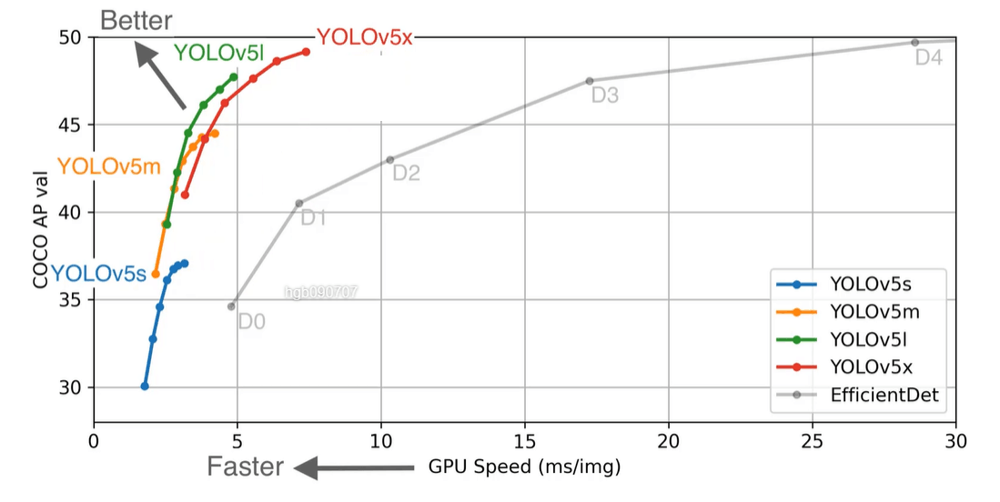
    <h4>image: yolov5 performance</h4>

</div>

<br><br>

##  2. <a name='yolo'></a>yolo的新功能
- 模型系列化
- 分布式训练
- FP16模型存储与推理
- 断点续传
- 批量预测图像
- Tensorboard可视化训练
- onnx、coreml等导出
- 二阶分类器
- 模型集成预测
- 模型剪枝
- conv 与 bn 的融合
<br><br>
# yolov5训练和预测技巧
- 预处理
    - 图像归一化
    - 矩形推理缩放
- 数据增强
    - mosaic
    - CutMix
    - CutOut
    - MixUp
- 训练优化
    - warmup
    - 超参数进化
    - autoAnchor
    - EMA(exponential moving average)
    - 学习率的调整
        - 余弦退火衰退
    - 多尺度训练
    - 梯度累积
- 后处理
    - Merge NMS
    - TTA(Test Time Augmentation)
<br><br>
##  3. <a name=''></a>学习目标
- 基础知识
    - 目标检测任务说明
    - 常用数据集
    - 性能指标和计算方法

- 小数据集举例训练（VOC）

- 原理
    - yolo目标检测的基本思想
    - yolo网络框架和组件
    - yolo损失函数
    - yolo目标框回归与跨网络预测
    - yolo训练技巧

- 代码
    - 项目目录结构
    - 模型构建相关代码解析
        - 激活函数及其代码
        - 网络组件及其代码
        - detect组件及其代码
        - model类及其代码
    
    - 数据集创建相关代码解析
        - 矩形推理与letterbox代码
        - 数据增强原理与代码
        - 自定义数据集代码
        - 数据集相关类代码
        - dataloader相关代码

    - general.py代码解析
        - autoAnchor代码
        - AP计算代码
        - build_targets代码
        - loss计算代码
        - 非极大值抑制代码

    - 辅助工具代码解析
        - torch_utils 代码
        - experimental代码

    - yolov5直接运行的代码
        - detect.py
        - test.py
        - trrain.py

##  4. <a name='yolov5network'></a>yolov5 network 框架
<div align = center>
    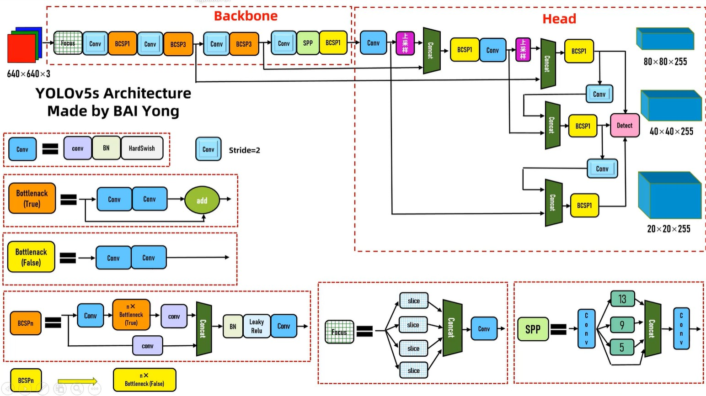
    <h4>image: yolov5 framework</h4>
</div>

##  5. <a name='objectdetection'></a>关于目标检测(object detection)
###  5.1. <a name='-1'></a>任务说明
<div align = center>
    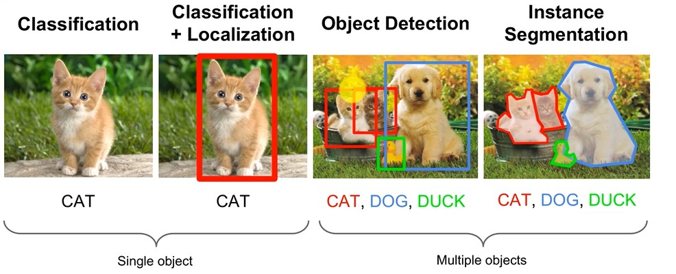
    <h4>image: 不同的任务</h4>
</div>

###  5.2. <a name='-1'></a>常用的数据集
- VOC 2007 和 VOC 2012
- MS COCO

<div align = center>
    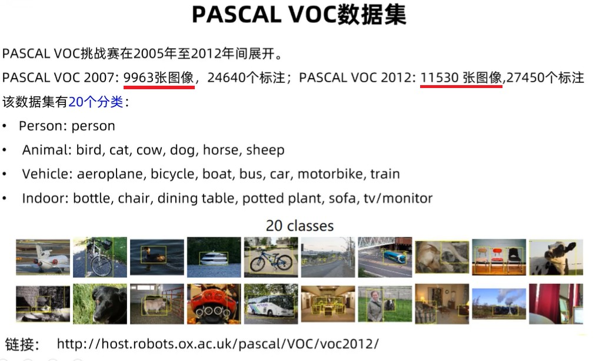
</div>
<br><br>
<div align = center>
    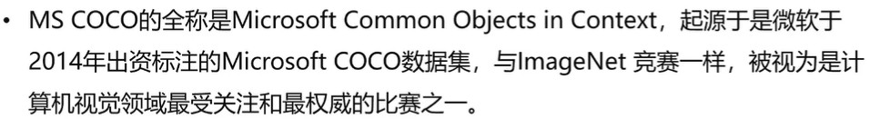
</div>

[coco link](http://cocodataset.org/)

- 80 个类别
- 超过50万类别的标注
- 平均每个图像目标数为7.2

###  5.3. <a name='-1'></a>性能指标
####  5.3.1. <a name='-1'></a>精度指标
<div align = center>
    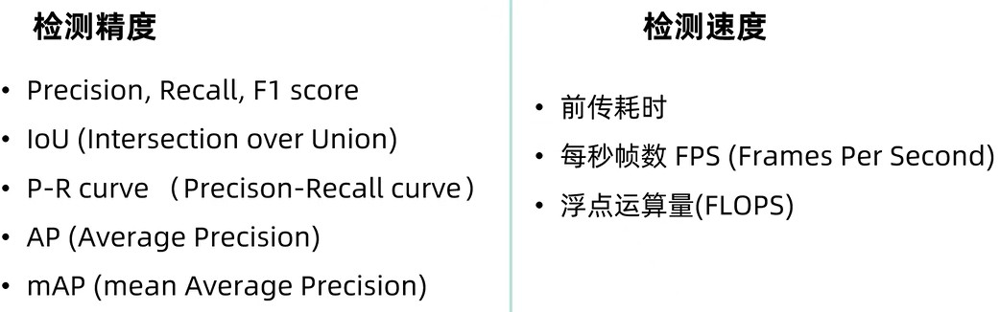
</div>

- 一个不完全合适的类比扔飞镖，5个目标
    - ref: [全面梳理：准确率,精确率,召回率,查准率,查全率,假阳性,真阳性,PRC,ROC,AUC,F1 - Theseus的文章 - 知乎](https://zhuanlan.zhihu.com/p/34079183)
    - precision: 你扔8次，你中了多少次(如果你扔了很多次，即使你最终5个都中了，但是你的精准率还是很差的)
    - recall: 5个目标你中了多少个（我不管你扔了多少次，只要你最后都中了就行）
    - 小结论： 所以说precision 和 recall 和不可兼得的。 不同的应用要权衡优先precision 或者 recall。
        - 要求recall高的：金融诈骗，允许有误报率，我不想放过任何一个可疑的诈骗，因为【代价高】
        - 要求precision高: 你得很确认的才给我做。你给我放进回收站里的可都得确定是垃圾，千万不能有正常邮件啊

    - FLOPS（floating-point operations per second）
<br><br>

#####  3.1.1. <a name='PrecisionandRecall'></a>Precision and Recall
<div align = center>
    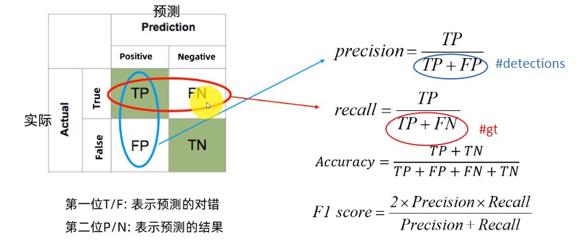
</div>
<br><br>

- 第一列是TP FP 是precision
- 混淆矩阵描述的永远是预测的结果
    - TP T：预测对了，预测为P
    - FP F：预测错了，预测结果为P
    等等

    例子：猫狗分类，猫是正样本
    那么 如果我看见一只猫，却认为认为它是狗，则这个样本是FN。因为首先你预测错了，你预测成了狗

- precision:  预测的准不准
- recall：找得全不全
<br><br>

#####  3.1.2. <a name='IOU'></a>IOU
<div align = center>
    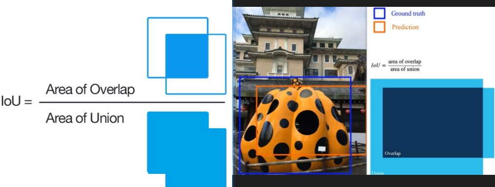
</div>

- 交并比
- IOU的进化
    - IOU -> GIOU -> DIOU -> CIOU
    - IoU_GIoU_DIoU_CIoU.ipynb
- 值域 [0, 1]
- 阈值
    - 例如 $IoU \geq Thres$ as TP
    - $IoU \leq Thres$ as FP
    - 如果连框都没有，但是其实是有物体的，那么就是FN
    - 我们忽略TN，因为我们不去预测负样本


<br><br>

#####  3.1.3. <a name='APandmAP'></a>AP and mAP
<div align = center>
    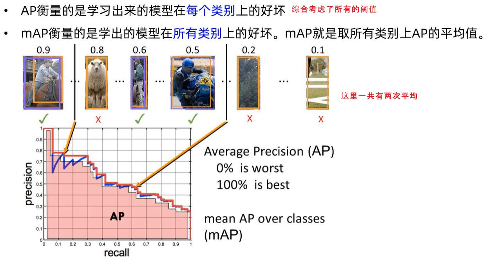
</div>

- AP是怎么算出来的呢？
    - 我们刚才已经搞清楚了precision 和 recall是怎么算出来的了，他们各自是由FP 和 FN 去决定的，而你是FP 还是 FN 其实是由你设置的阈值来决定的。所以我们可以说，每一个阈值，我们就会有不一样的precision 和 recall（他们的值构成了一对点)。那么我将阈值从0 到 1 都选一遍，就可以得到很多个点。我就可以描绘出这个曲线了。（而这仅仅只是一个类而已）
    - 得到了曲线后，我们再去算出PR曲线下的面积，面积就是AP值。


- mAP
    - 将上面的步骤对每一个类都做一遍，求平均，我们就可以得到mAP

<div align = center>
    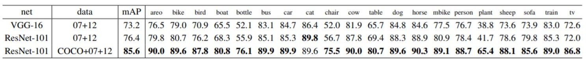
</div>

<br>

- 在coco中
    - AP@.5 指的是 AP with IOU = 0.5
    - AP@.75 指的是 AP with IOU = 0.75
    - AP@[.5 : .95] 指的是 mean AP with IOU from 0.5 to 0.95 with step size of 0.05

    $$
    \begin{align}
        mAP_{coco} = \frac{mAP_{0.5} + mAP_{0.55} + ... mAP_{0.95} }{10}
    \end{align}
    $$

    - 快速过一下一些概念眼熟一下
    <div align = center>
        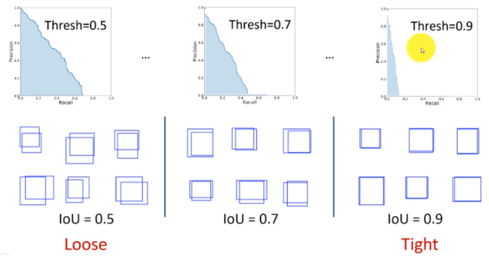
    </div>

    <div align = center>
        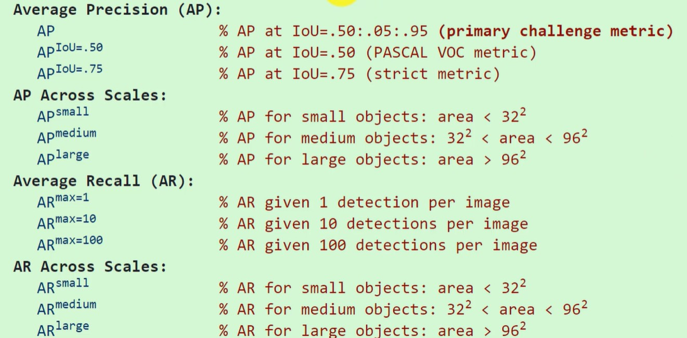
    </div>

#####  3.1.4. <a name='AP'></a>AP的计算
- ref: https://www.youtube.com/watch?v=FppOzcDvaDI&t=359s

- 步骤：
    1. 获取所有的bbox
    2. 按confidence降序排列所有bboxes
    3. 计算所有的precision 和 recall
    4. 画出PR 曲线
    5. 计算出PR 曲线下的面积
    6. 计算其他类的AP
    7. 在其他的IOU阈值下计算mAP

    - 详细请查阅 calculate_mAP.pdf

####  5.3.2. <a name='-1'></a>速度指标
    
- forward time ：包括前处理（图像归一化等），网络前传，后处理耗时（NMS等）
- FPS：每秒钟能够处理的图像数量
- FLOPS：处理一张图需要多少的浮点运算数量，跟具体的硬件没有关系。可以公平地比较不同算法之间的检测速度。

##  6. <a name='yolo-1'></a>下载 yolo 跑一跑
1. 将项目clone到你的vscode里
    ``` bash
    git clone https://github.com/ultralytics/yolov5.git
    ```

2. 确保环境已经安装好了

3. 下载预训练权重并放在weights里面

4. 测试一下，运行跑一跑结果detect.py的结果
- 
    ```bash
    python detect.py --source ./data/images/ --weights weights/yolov5s.pt --conf 0.4
    ```
- 请确保你的图片在上面的路径下，或者你自己找对路径（学习的时候请创建跟老师一样的路径）

##  7. <a name='-1'></a>准备数据集
1. 下载voc
    - voc 官网: http://host.robots.ox.ac.uk/pascal/VOC/index.html
    - <div align = center>
        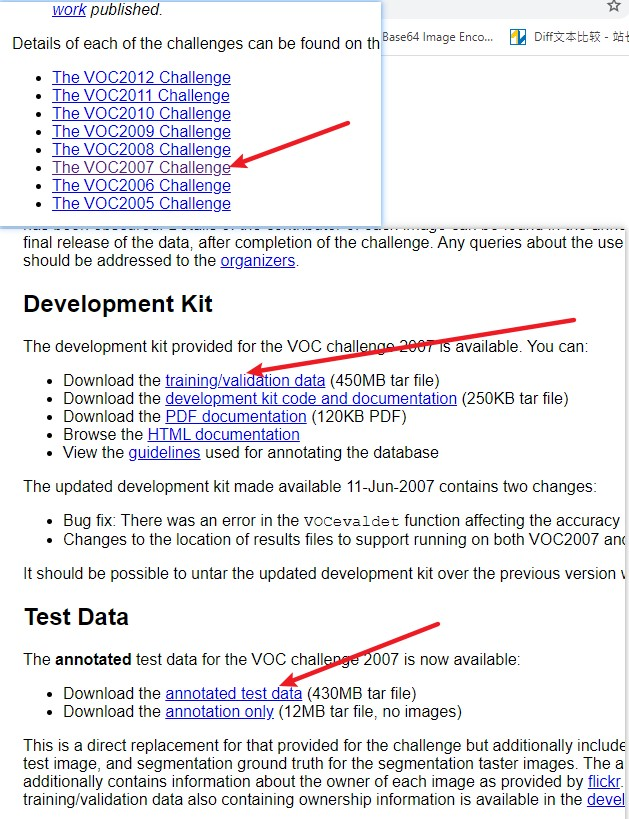
    </div>

    - <div align = center>
        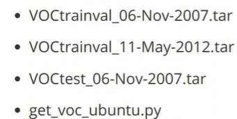
    </div>
    - voc 的数据集label格式是xml,我们要将其转换成txt

2. 生成训练集和验证集文件
    - 解压数据集
    ```bash
    tar xf VOCtrainval_06-Nov-2007.tar
    tar xf VOCtrainval_06-Nov-2007.tar
    ```
    解压过后他们会在同一个文件夹里
    文件目录如下w
    -   ```bash
        |-- VOCdevkit
        |   -- VOC2007
        |       |-- Annotations
        |       |-- ImageSets
        |       |-- JPEGImages
        |       |-- SegmentationClass
        |       |-- SegmentationObject
        |-- VOCtest_06-Nov-2007.tar
        |-- VOCtrainval_06-Nov-2007.tar
        |-- get_voc_ubuntu.py


        接着执行脚本

        python get_voc_ubuntu.py # 将xml转换成txt，并将其移动到VOC文件夹里，且分好了train 和 val
        ```


- 执行完上面的脚本后，出现了VOC文件夹，目录结构如下
-   ```bash
    ./VOC
    |-- images
    |   |-- train
    |   `-- val
    `-- labels
        |-- train
        `-- val
    ```
- train.txt和2007_test.txt分别给出了yolov5训练集图片和yolov5验证集图片的列表，含有每个图片
的路径和文件名
- VOC/images文件夹下有train和val文件夹，分别放置yolov5训练集和验证集图片；VOC/labels文
件夹有train和val文件夹，分别放置yolov5训练集和验证集标签（yolo格式）

##  8. <a name='-1'></a>修改配置文件
1. 在data/ 里修改data/voc.yaml的路径
    ```yaml
    train: /datav/shared/dataset/VOC/images/train/ 
    val: /datav/shared/dataset/VOC/images/val/       
    ```
2. 创建models/yolov5s_for_voc2007.yaml，修改nc为20

##  9. <a name='-1'></a>开始训练
1. 训练命令
- vscode当前工作路径  
```bash
/datav/shared/hgb/yolov5

python train.py --data data/voc.yaml --cfg models/yolov5s_for_voc2007.yaml --weights weights/yolov5s.pt --batch-size 16 --epochs 200
```
2. runs

3. hyp.yaml 和 opt.yaml
- 初始超参 data/hyp.scratch.yaml
- 进化后的超参：runs/train/exp/hyp.yaml
- runs/train/exp/opt.yaml

4. 查看tensorboard.
- ./train.bash 后 通过tensorboard --logdir runs/train --bind_all 启动tensorboard
    - ref: [了解tensorboard的使用](https://github.com/tensorflow/tensorboard/blob/master/README.md)
- 点击ports，到local address处 点击open in browser

<br><br>


##  10. <a name='-1'></a>目标检测基本思想
<div align = center>
    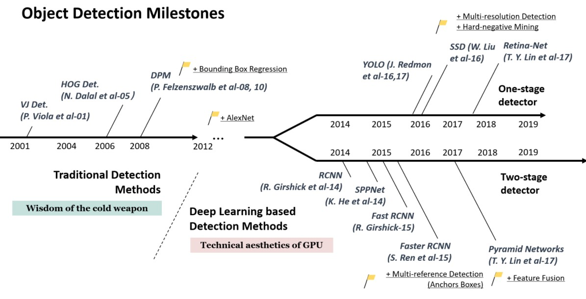
</div>

- onestage 和 two stage
<br><br>

<div align = center>
    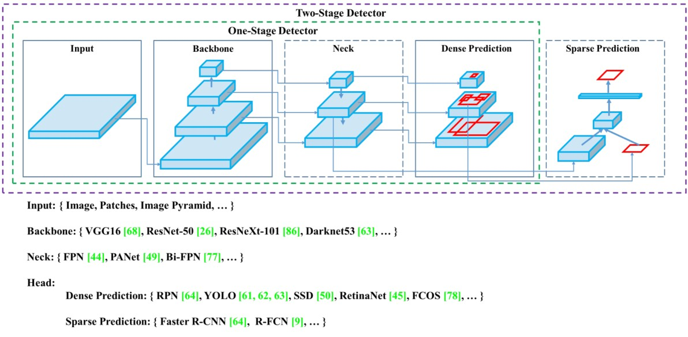
</div>

- input->backbone->neck->head

<br><br>


<div align = center>
    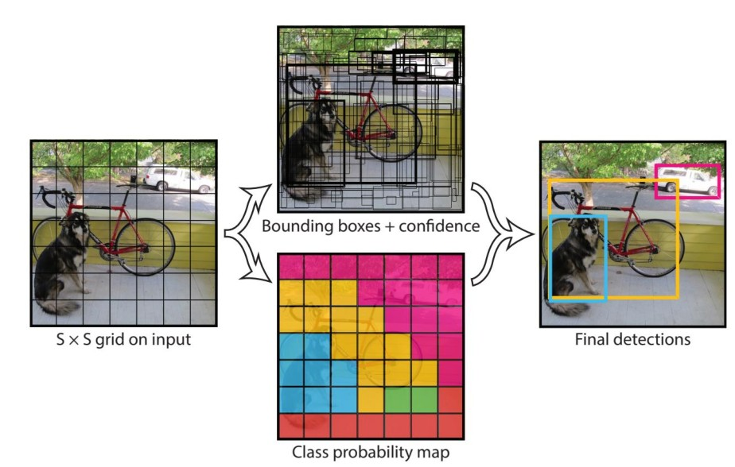
</div>

- 给一张图，以一定大小的网格去划分这张图，每个格子的左上角都会做一个预测框，预测框的大小不一，预测框的中心在该格子左上角的附近。比如，若狗为正样本，如果该框的框到的是狗，那么它就再做回归和调整，使得最后完美框起狗实现了检测和定位。

<br><br>

<div align = center>
    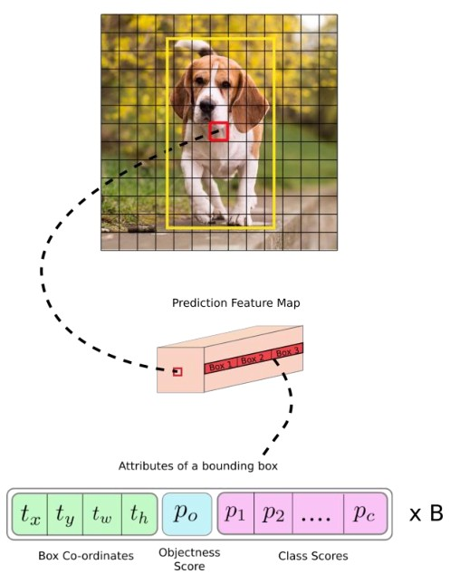
</div>

- 拿一个格子来做例子，对一个格子，我们将其编码为一条向量，这条向量含有了bbox的重要信息


<div align = center>
    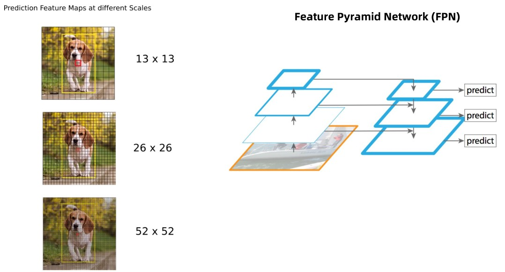
</div>

- 多尺度融合。划分得越细证明越多小格子，每个小格子管理的范围的越小，越有利于检测小目标

<div align = center>
    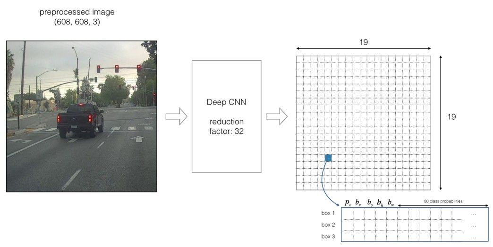
</div>

- 如图，一张图片经过DNN之后，得到了19x19的feature map，该feature map映射回去，其实是一个小格有一个一定大小的感受野。

###  10.1. <a name='Anchor'></a>Anchor机制
<div align = center>
    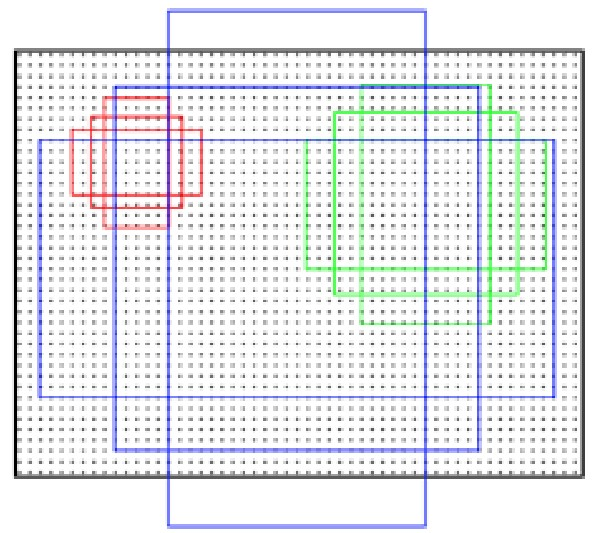
</div>

- 不同颜色的就是不同的scale（尺度）
- 不同于yolov4， yolov5的GT可以被多个尺度的prediction进行匹配的（跨层预测）。例如：即有些predicted bbox在 中型gt也能匹配的不错，在大型gt也能匹配的不错。所以匹配范围是3 ~ 9个。
- <b>维度信息：</b> 如果featuremap 13 x 13 x 3 x (5 + C) # C = 80 for coco
- 3 ：一个尺度下有多少种形状（这里有三种，矮长方形，高长方形，正方形）
    - conf score = box conf x conditional probability
    - 定位得分 x 分类得分
    - <div align = center>
        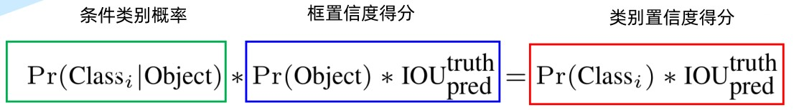
    </div>


###  10.2. <a name='NMS'></a>NMS
<div align = center>
    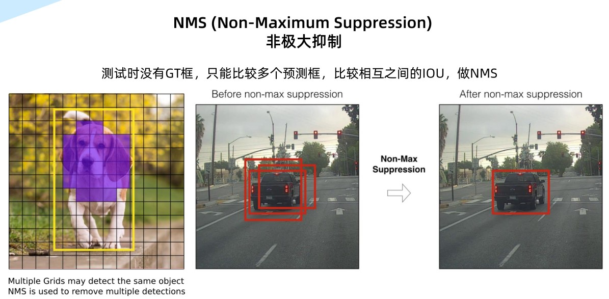
</div>

<br><br>

## YOLO系列框架

<div align = center>
    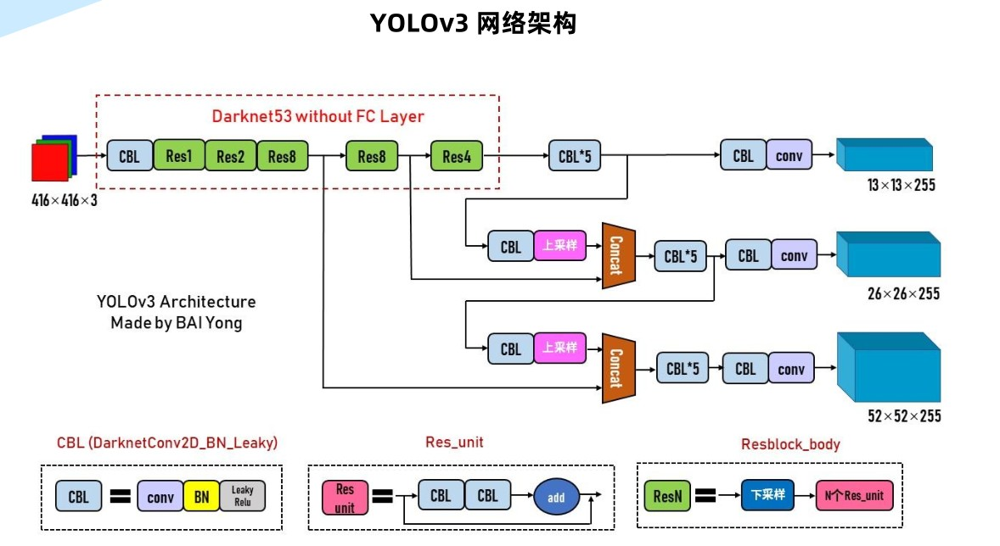
</div>

<div align = center>
    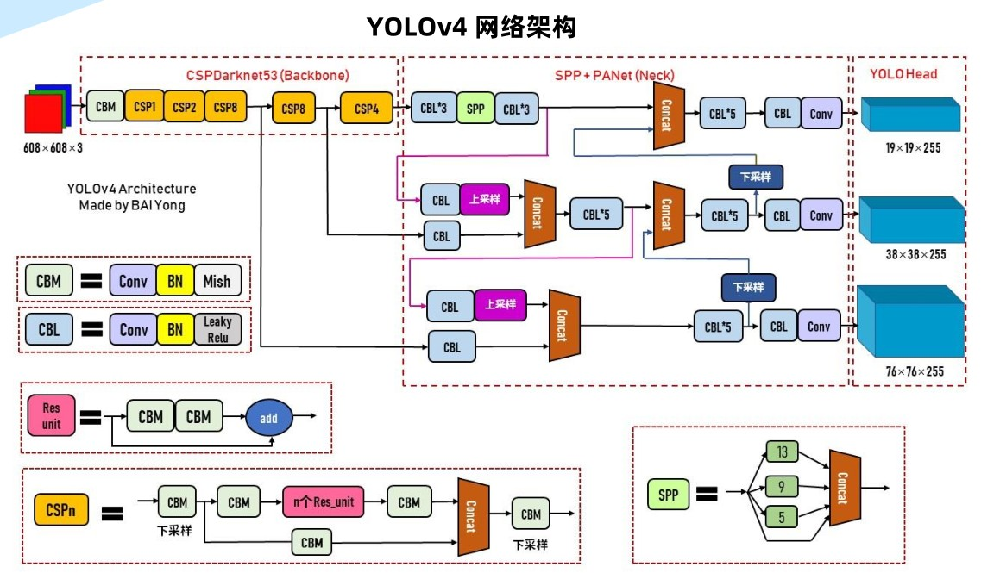
</div>

<br><br>

## loss 损失函数
<div align = center>
    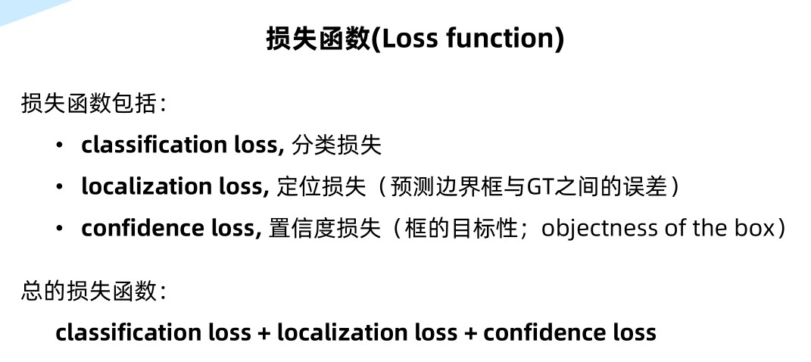
</div>


    
    


# Reference
- [系统性比较好的yolov5讲解](https://www.bilibili.com/video/BV1NA411s7Ba?from=search&seid=11897837956125787800&spm_id_from=333.337.0.0)

- [Mean Average Precision (mAP) Explained and PyTorch Implementation](https://www.youtube.com/watch?v=FppOzcDvaDI&t=359s)