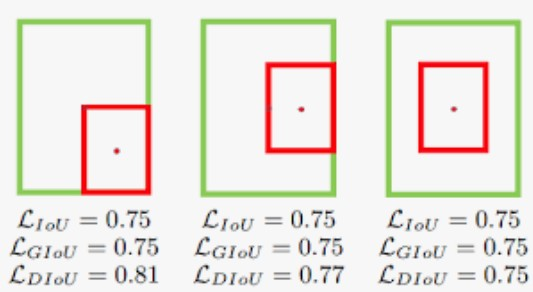

<!-- vscode-markdown-toc -->
* -------------------- EN -------------------------
* 1. [l1-norm and l2-norm](#l1-normandl2-norm)
* 2. [IoU (intersection of the Union)](#IoUintersectionoftheUnion)
* 3. [GIoU is comming](#GIoUiscomming)
* 4. [DIoU](#DIoU)
* 5. [CIoU](#CIoU) 
* -------------------- 中文 -------------------------
* 6. [l1-norm and l2-norm](#l1-normandl2-norm-1)
* 7. [IoU (intersection of the Union)](#IoUintersectionoftheUnion-1)
* 8. [GIoU is comming](#GIoUiscomming-1)
* 9. [DIoU](#DIoU-1)
* 10. [CIoU](#CIoU-1)

<!-- vscode-markdown-toc-config
	numbering=true
	autoSave=true
	/vscode-markdown-toc-config -->
<!-- /vscode-markdown-toc -->

[code](imgs/IoU_GIoU_DIoU_CIoU.ipynb)

##  1. l1-norm and l2-norm

    

- l1 and l2 are just the methods to compare bbox conrners directly. That is too simple and not always suitable

So we introduce the IoU series.

##  2. IoU (intersection of the Union)
- Pros: 1 - IoU as the loss function is better metric. Because it considers about the intersection which is the area.

- Cons: However, if no overlap exists between two bboxes, IoU will be 0. At this moment, loss function will not care the distance between the two bboxes any more, which is not what we want. And what's more, if intersection is 0, 0 as a loss value, resulting 0 gradient, brings an unoptimizable problem.
- $IoU \in [0,1]$ 

##  3. GIoU is comming
$$
\begin{align}
    GIoU = IoU - \frac{|A_c - U|}{|A_c|}
\end{align}
$$
- GIoU = IoU part - C part

Simply speaking, the introduction of the smallest enclosing convex object C is a way to avoid 0 loss to happen.
- e.g. A B two boxxes
- if A B are close, IoU -> 1, Cpart -> 0 # 1 - 0 = 1
- if A B are far from each other, IoU -> 0, Cpart -> 1 # 0 - 1 = -1 
- therefore $GIoU = [-1, 1]$  # from far to close
- $loss_{GIoU} = 1 - GIoU , [2, 0]$ #  from far to close
    - good feature: $loss_{GIoU}$ is non negative.
    - a suitable reflection of how two bboxes are overlaped.

    

  

##  4. DIoU

$$
\begin{align}
    L_{DIoU} = 1 - IoU + \frac{\rho^2(b, b_{gt})}{c^2}
\end{align}
$$

    

- In order to compare the similarity in a more resonable way, both distance of d and distance of c are used such that the following situation can be avoided where we have same IoU and GIoU due to same overlap area but the overlap has a different orientation.

    

##  5. CIoU
- not just the orientaion, the ratio of the w h of the bboxes are also important.

$$
\begin{align}
    L_{CIoU} &= 1 - IoU + \frac{\rho^2(b, b_{gt})}{c^2} + \alpha v \\
    \alpha   &= \frac{v}{1 - IoU + v} \\
    v &= \frac{4}{\pi^2}  arctan (\frac{w^{gt}}{h^{gt}} - arctan\frac{w}{h})^2

\end{align}

$$

##  6. l1-norm and l2-norm

    

- L1和l2loss只是直接比较bbox四个角的方法。这太简单了，并不总是合适的  

所以我们引入IoU系列

##  7. IoU (intersection of the Union)
 - 优点: 1 - IoU作为损失函数是更好的度量。因为它考虑的是交集，也就是面积。

- 缺点:但是，如果两个框之间没有重叠，IoU将为0。此时loss function将不再关心两个box之间的距离，这不是我们想要的。并且，如果交集为0, 0作为损失值，导致梯度为0，则会使得问题不能被优化。

- $IoU \in [0,1]$ 

##  8. GIoU is comming
$$
\begin{align}
    GIoU = IoU - \frac{|A_c - U|}{|A_c|}
\end{align}
$$
- GIoU = IoU part - C part

简单地说，引入最小外包框是避免 0 loss发生的一种方法。
- 例如A B两个bbox
- 如果A B较为接近，IoU -> 1, Cpart -> 0 # 1 - 0 = 1 
- 如果A和B之间距离很远， IoU -> 0, Cpart -> 1 # 0 - 1 = -1  
- 因此$GIoU = [- 1,1]$ # from far to close
- $loss_{GIoU} = 1 - GIoU， [2,0]$ # from far to close
- 好的特性:$loss_{GIoU}$是非负的。
- 恰当地反映了对两个bboxes是如何重叠的。

    

  

##  9. DIoU

$$
\begin{align}
    L_{DIoU} = 1 - IoU + \frac{\rho^2(b, b_{gt})}{c^2}
\end{align}
$$

    

- 为了更合理地比较相似性，我们同时使用了d和c的距离，避免了IoU和GIoU相同，但重叠位姿不同的情况。

    

##  10. CIoU
- 不仅仅是方向，bbox的w和h的比率也很重要。

$$
\begin{align}
    L_{CIoU} &= 1 - IoU + \frac{\rho^2(b, b_{gt})}{c^2} + \alpha v \\
    \alpha   &= \frac{v}{1 - IoU + v} \\
    v &= \frac{4}{\pi^2}  arctan (\frac{w^{gt}}{h^{gt}} - arctan\frac{w}{h})^2

\end{align}

$$

