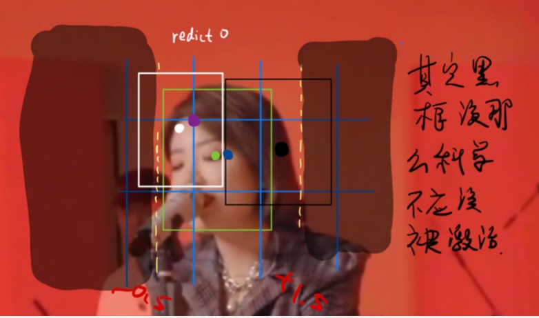

<!-- vscode-markdown-toc -->
* 1. [loss function](#lossfunction)
	* 1.1. [class prediction](#classprediction)
	* 1.2. [bbox regression](#bboxregression)
* 2. [Annotation Format](#AnnotationFormat)
* 3. [bbox regression](#bboxregression-1)

<!-- vscode-markdown-toc-config
	numbering=true
	autoSave=true
	/vscode-markdown-toc-config -->
<!-- /vscode-markdown-toc -->

##  1. loss function 
- classification loss (binary cross entropy loss)
- localization loss (the error between predicted bbox and gt bbox) (CIOU loss)
- confidence loss (binary cross entropy loss)
- total: the weighted sum of the above three

###  1.1. class prediction
- we use multiple independent binary cross entropy loss instead of a softmax for reducing computation complexity

###  1.2. bbox regression
- replace l1 or l2-norms with IoU series loss function
- [IoU series code](imgs/IoU_GIoU_DIoU_CIoU.ipynb)
- [IoU series theory](IoU-series.md)
    - evolution: l2-norm --> IoU --> GIoU --> DIoU --> CIoU

##  2. Annotation Format
- voc format

    

- yolo format

    

##  3. bbox regression
- prerequisite: 
    - for each image, we put a ***grid*** on it. The grid size depends on you. In yolov5 for coco, they are (80, 80), (40,40) and (20, 20), which acutally are the size of the feature map.
    - for each block of the grid, the top left corner of it has the capability of predicting a bbox, which will be learned to adjusted to match the groundtruth.

Anchor gives the intial value of prediction of w and h. what to be regressed is the ***offset*** between intial w h and the real w h.

    
    <h4>image: yolov4.jpg</h4>

    
    <h4>image: yolov5.jpg</h4>

  

yolov5 relaxes the output limit a little bit comparing with the output in yolov4, which is only in [0,1].

- $2\sigma(t_x) - 0.5 \in (-0.5, 1.5) $ due to $2 (0, 1) - 0.5$ 

- With more positive samples, convergence is more easilly to attained.

We also put a constraint on the w and h, which in the range of (0, 4), meaning that the biggest prediction of w or h is 4w or 4h.

- modify the hypyer parameter in anchor_t:4.0 from data/hyp.scratch.yaml

***visulization***:

    

e.g. Under the settings of 40 x 40 feature map, we have a 40 x 40 grid on the image where a girl(gt marked with green) is on it. Dot green is the center of the gt. Focus on the purple dot(the top left corner of the block in the discussion). The purple dot predicts three bboxes of different shape also with different position(x,y). We try out best to regress the 3 bboxes to the green gt.
  

    

Notice that the blue dot is the center of the current block. Both white bbox and black box are the predicted bbox around the purple dot (in the range of $[-0.5, +1.5]$). If the gt is on the left of block center, we see the white bbox is the better predition(positive extended sample). If on the right, black bbox takes the chance. 

