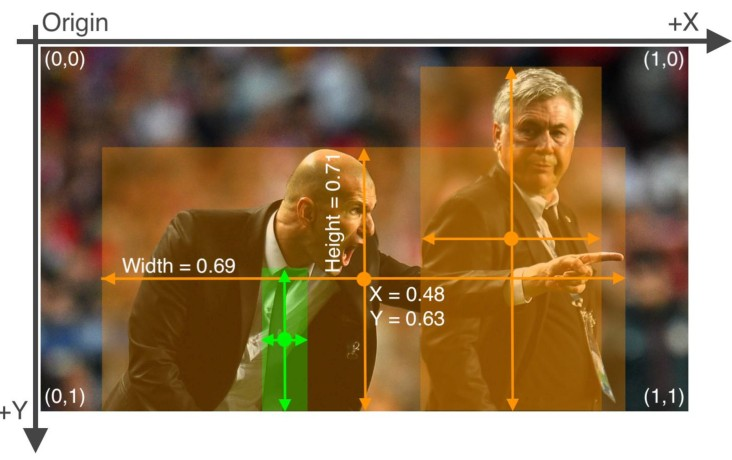

##  1. loss function 
- classification loss (binary cross entropy loss)
- localization loss (the error between predicted bbox and gt bbox) (CIOU loss)
- confidence loss (binary cross entropy loss)
- total: the weighted sum of the above three

###  1.1. class prediction
- 我们使用多个独立的二元交叉熵损失来代替softmax来降低计算复杂度  

###  1.2. bbox regression
- replace l1 or l2-norms with IoU series loss function
- [IoU series code](imgs/IoU_GIoU_DIoU_CIoU.ipynb)
- [IoU series theory](IoU-series.md)
    - evolution: l2-norm --> IoU --> GIoU --> DIoU --> CIoU

##  2. Annotation Format
- voc format

    

- yolo format

    

##  3. bbox regression
先决条件:  
- 对于每个图像，我们在上面放置一个***网格***。 在yolov5 coco中，它们分别是(80,80)、(40,40)和(20,20)，这实际上是feature map的大小。  
- 对于网格的每个块，它的左上角可以预测3个框，然后被调整成可以匹配gt。

Anchor给出w和h预测的初始值，回归的是初始wh与实际wh之间的***偏移***。 

    
    <h4>image: yolov4.jpg</h4>

    
    <h4>image: yolov5.jpg</h4>

  

与yolov4的输出相比，yolov5的输出稍微宽松了一点.

- $2\sigma(t_x) - 0.5 \in (-0.5, 1.5) $ due to $2 (0, 1) - 0.5$ 

- 正样本越多，收敛越容易达到。  

我们还对w和h进行了限制，在(0,4)范围内，意味着w或h的最大预测是4w或4h。  

- 可以在data/hyper.scratch.yaml中修改anchor_t:4.0 

***visulization***:

    

在40 x 40 feature map的情况下，我们在图像上有一个40 x 40的网格，其中有一个女孩(gt用绿色标记)。 绿色的圆点是gt的中心。让我们关注紫色的圆点(方块的左上角)。 紫色的点预测三个不同形状和不同位置的bbox(x,y)。 我们尝试将3个bbox退回到绿色gt。  
  

    

注意，蓝点是当前方块的中心。 白bbox和黑bbox都是紫点周围的预测bbox(在$[-0.5，+1.5]$的范围内)。 如果gt在block中心的左边，我们可以认为白色的bbox是更好的预测(positive扩展样本)。 如果在右边，黑bbox是更合理的样本。  

