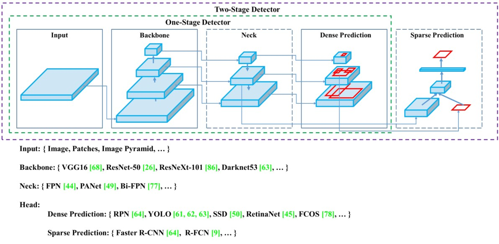
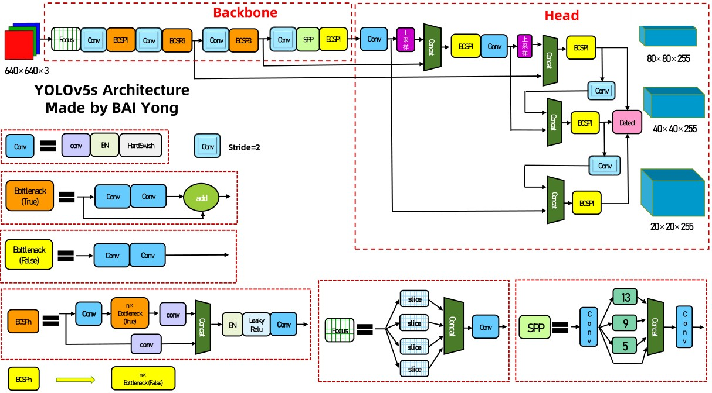
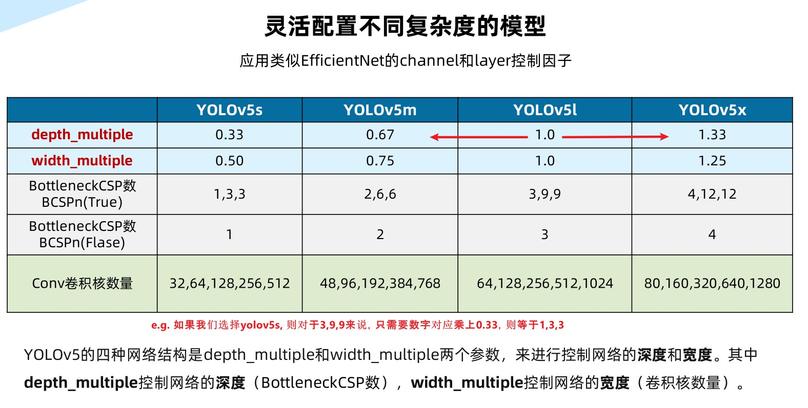
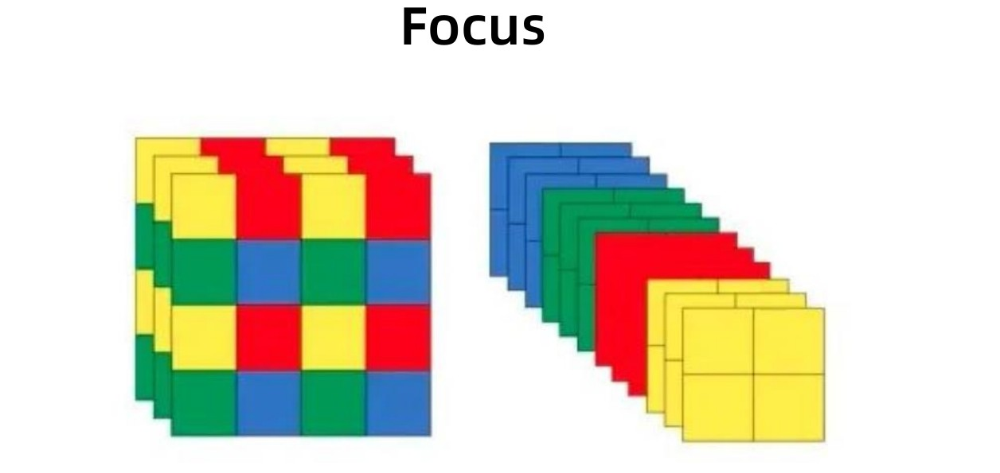
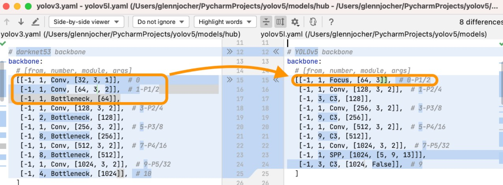
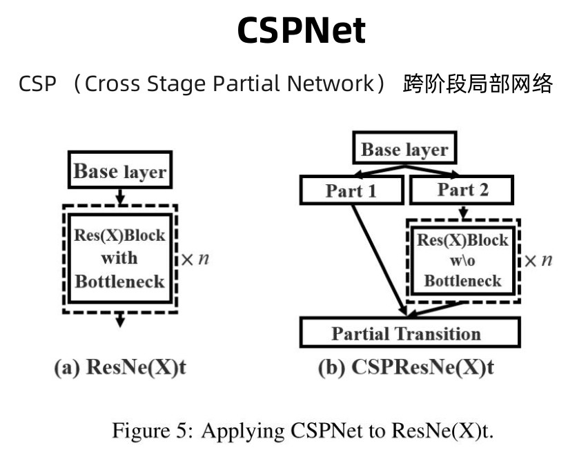
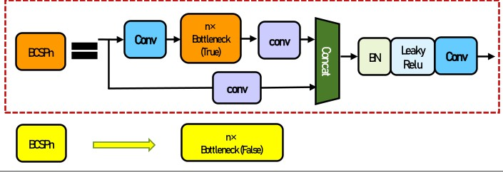

<!-- vscode-markdown-toc -->
* 1. [网络架构与组件](#)
	* 1.1. [Focus](#Focus)

<!-- vscode-markdown-toc-config
	numbering=true
	autoSave=true
	/vscode-markdown-toc-config -->
<!-- /vscode-markdown-toc -->

##  1. <a name=''></a>网络架构与组件

<div align = center>
    
</div>

- 对于yolo而言：
    - backbone： focus，bottleneckCSP, SPP
    - Head: PANet + Detect(YOLOV3 / V4 head)

- netron 可视化网络
    - models/export.py
    - ```bash
        python models/export.py --weights weights/yolov5s.pt --img 640 --batch 1
        ```
        - 确保你的yolov5s.pt 是对应你的yolov5 version
- yolov5的配置文件的解读
    - comments_version/models/yolov5s.yaml
    - <div align = center>
        
    </div>

    - 下采样倍数的举例说明：focus 和 4 个 conv 一共5个1/2下采样（浅蓝色），所以是2^5=32倍下采样。下一个conv stride = 1 （从onnx中找到resize可反推）
    - 注意带有突起的conv是stride = 2的，具有下采样的特性，而没有突起的conv stride = 1

- 灵活配置
    - <div align = center>
        
    </div>


###  1.1. <a name='Focus'></a>Focus
<div align = center>
    
</div>

#### 理论
- 把数据切分为4份，每份数据都是相当于2倍下采样得到的，然后在channel维度进行
拼接，最后进行卷积操作。

```python
You can do a small experiment like this:
Create a toy tensor x
tensor([[[[11, 12, 13, 14],
[21, 22, 23, 24],
[31, 32, 33, 34],
[41, 42, 43, 44]]]])
Pass x to Focus layer and the result is
tensor([[[[11, 13],
[31, 33]],
[[21, 23],
[41, 43]],
[[12, 14],
[32, 34]],
[[22, 24],
[42, 44]]]])
```
- [Focus层的作用和缘由](https://blog.csdn.net/qq_39056987/article/details/112712817)
    - 拿focus代替原来yolov3的三个conv
    - <div align = center>
        
    </div>

### [代码实现](comments_version/models/common.py)


-  先实现标准卷积 (conv = conv2d + bn + hardswish)
    
    - 自动填充
    
    $$
    \begin{align}
    in - k + 2p = out = in \\
    then \quad 2p = k \\
    then \quad p = int(\frac{k}{2})

    
    \end{align}
    $$

    ```python
    # 为same卷积或者same池化自动扩充, 自动选择正确的p
    def autopad(k, p = None):
        # Pad to 'same' 如果不指定padding size，我们就直接padding到它的size与原来一样大
        if p is None:
            p = k // 2 if isinstance(k, int) else [x // 2 for x in k] # 如果传入的k是(ksize, ksize)
 
    class Conv(nn.Module):
        # Standard convolution 标准卷积：conv+BN+hardswish （注意标准卷积这里的k 和 s 都是1）
        def __init__(self, c1, c2, k = 1, s = 1, p = None, g = 1, act = True): # ch_in, ch_out, kernel, stride, padding, groups
            super(Conv, self).__init__()
            self.conv = nn.Conv2d(c1, c2, k, s, autopad(k, p), groups = g, bias = False)
            self.bn = nn.BatchNorm2d(c2)
            self.act = nn.Hardswish() if act else nn.Identity() # todo hardswish

        def forward(self, x):
            return self.act(self.bn(self.conv(x)))

        def fuseforward(self, x):
            return self.act(self.conv(x)) # todo fuseforward

    ```

- 有了标准卷积后，我们就可以实现Focus了
    ```python
    class Focus(nn.Module):
        # Focus wh information into c-space
        def __init__(self, c1, c2, k=1, s=1, p=None, g=1, act=True):  # ch_in, ch_out, kernel, stride, padding, groups
            super(Focus, self).__init__()
            self.conv = Conv(c1 * 4, c2, k, s, p, g, act) # 因为focus 是先切片，在通道方向堆叠，所以到真正卷积的时候c_in 需要4倍

        def forward(self, x):  # x(b,c,w,h) -> y(b,4c,w/2,h/2)
            return self.conv(torch.cat([x[..., ::2, ::2], x[..., 1::2, ::2], x[..., ::2, 1::2], x[..., 1::2, 1::2]], 1))
            # ...指的是取完通道， ::2 行step 为2 去取（黄色）（绿色）（红色）（蓝色）

    ```


## CSPNet

<div align = center>
    
</div>

<div align = center>
    
</div>

```python

class Bottleneck(nn.Module):
    # Standard bottleneck
    def __init__(self, c1, c2, shortcut=True, g=1, e=0.5):  # ch_in, ch_out, shortcut, groups, expansion
        super(Bottleneck, self).__init__()
        c_ = int(c2 * e)  # hidden channels
        self.cv1 = Conv(c1, c_, 1, 1)
        self.cv2 = Conv(c_, c2, 3, 1, g=g)
        self.add = shortcut and c1 == c2 # 只有当我想要搞shortcut而且c1 == c2(cin==cout)的时候才可以走捷径

    def forward(self, x):
        # 根据self.add的值确定是否有shortcut
        return x + self.cv2(self.cv1(x)) if self.add else self.cv2(self.cv1(x))


class BottleneckCSP(nn.Module):
    # CSP Bottleneck https://github.com/WongKinYiu/CrossStagePartialNetworks
    def __init__(self, c1, c2, n=1, shortcut=True, g=1, e=0.5):  # ch_in, ch_out, number, shortcut, groups, expansion
        super(BottleneckCSP, self).__init__()
        c_ = int(c2 * e)  # hidden channels
        self.cv1 = Conv(c1, c_, 1, 1)
        self.cv2 = nn.Conv2d(c1, c_, 1, 1, bias=False)
        self.cv3 = nn.Conv2d(c_, c_, 1, 1, bias=False)
        self.cv4 = Conv(2 * c_, c2, 1, 1)
        self.bn = nn.BatchNorm2d(2 * c_)  # applied to cat(cv2, cv3)
        self.act = nn.LeakyReLU(0.1, inplace=True)
        # *操作符可以把一个list拆开成一个个独立的元素, 使得他们可以塞进去sequential 且 当作一个新的模块 （这里的n其实就是 n x bottleneck）
        self.m = nn.Sequential(*[Bottleneck(c_, c_, shortcut, g, e=1.0) for _ in range(n)])

    def forward(self, x):
        y1 = self.cv3(self.m(self.cv1(x))) # 上面先conv一下再n x bottleneck 一下 再 conv一下
        y2 = self.cv2(x)
        return self.cv4(self.act(self.bn(torch.cat((y1, y2), dim=1))))
    
    def forward(self, x):
        y1 = self.cv3(self.m(self.cv1(x)))
        y2 = self.cv2(x)

```


